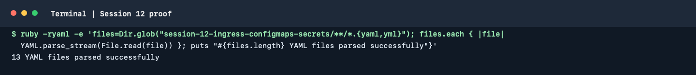

# Session 12: Ingress, ConfigMaps and Secrets

This session demonstrates application configuration, Kubernetes Secret
consumption, Ingress routing and troubleshooting. Each lab is independent;
use a cluster with the required Ingress controller for the Ingress exercises.

## ConfigMap

Use the [`01-configmap/`](./01-configmap/) example to create non-sensitive
configuration and inject it into a Pod:

```bash
kubectl apply -f 01-configmap/app-config.yaml
kubectl get configmap
kubectl describe configmap <configmap-name>
```

Verify the injected environment values or mounted files from inside the
application container.

## Secret

Use [`02-secret/`](./02-secret/) to create a Secret and consume its keys from
a Pod:

```bash
kubectl apply -f 02-secret/db-secret.yaml
kubectl get secrets
kubectl describe secret <secret-name>
```

Base64 encoding is not encryption. Never commit real passwords, tokens,
private keys or production Secret values to Git. The checked-in values in
this exercise are placeholders for learning only; create real lab values
locally or use a secret manager, and do not print them in logs or screenshots.

## Ingress and Ingress Controller

Apply an application and Service before applying an Ingress:

```bash
kubectl apply -f 03-ingress/path-based.yml
kubectl get ingress
kubectl describe ingress <ingress-name>
```

An **Ingress** is a Kubernetes API resource that declares HTTP(S) host and
path routing rules. An **Ingress Controller** is the running implementation
that watches those resources and configures a proxy/load balancer to enforce
the rules. The resource alone does not route traffic; a compatible controller
must be installed, running and selected by the class/configuration.

For the full Minikube walkthrough, use
[`04-full-demo/README.md`](./04-full-demo/README.md). It covers ConfigMap and
Secret injection, frontend/backend Services, path routing and cleanup.

## Troubleshooting lab

Use the manifests and investigation process in
[`troubleshooting/`](./troubleshooting/):

1. Apply the broken resource and record its status.
2. Inspect it with `kubectl describe` and read Events.
3. Identify the root cause before changing the manifest.
4. Apply the fix and verify the resource and application connectivity.
5. Record actual before/after output; redact sensitive values.

Useful commands:

```bash
kubectl get pods,services,ingress
kubectl describe pod <pod-name>
kubectl get events --sort-by=.metadata.creationTimestamp
kubectl logs <pod-name>
kubectl get endpoints <service-name>
```

Do not claim successful cluster execution from the example output in a lab
guide; capture the output from your own cluster.

## Terminal proof

The captured command parsed all 13 YAML files in this session. It checks
manifest syntax. ConfigMap, Secret and Ingress behavior was also exercised on
the local `session-labs` cluster; results are recorded below.



### Local command run

Commands ran in the isolated `session12-ingress` namespace:

```text
ConfigMap yatri-app-config: created; 5 data keys verified with get/describe
Secret yatri-db-secret: created; 3 data keys verified (values not printed)
Ingress controller: NGINX addon enabled; controller Pod Ready
frontend-service and backend-service: each had 1/1 Ready Pod and a Service endpoint
app-ingress: created for host myapp.local; controller scheduled a sync
curl -H 'Host: myapp.local' http://127.0.0.1:18080/ -> HTTP 200, NGINX welcome page
curl -H 'Host: myapp.local' http://127.0.0.1:18080/api/ -> HTTP 404 from the test backend's default NGINX page
```

The ingress controller was tested using a temporary local port-forward. The
`/api/` request reached the backend Service, but the temporary NGINX test
backend has no `/api` handler, so its 404 is not evidence of a routing failure.
No cloud resources or credentials were used. The controller addon and lab
resources remain running; cleanup was not performed.
