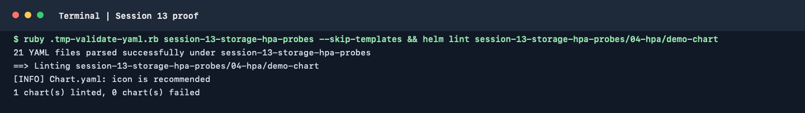

# Session 13: Kubernetes Storage, HPA and Probes

This session combines temporary and persistent storage, autoscaling and
container health checks. Run the labs on a cluster with a default
StorageClass and Metrics Server where those features are required.

## Storage

The examples are in [`01-volumes/`](./01-volumes/) and
[`02-persistent-storage/`](./02-persistent-storage/):

```bash
kubectl apply -f 01-volumes/emptydir-pod.yaml
kubectl apply -f 01-volumes/hostpath-pod.yaml
kubectl apply -f 02-persistent-storage/pv.yaml
kubectl apply -f 02-persistent-storage/pvc.yaml
kubectl apply -f 02-persistent-storage/pod.yaml
kubectl get pods,pv,pvc
```

`emptyDir` data lasts for the lifetime of a Pod. `hostPath` uses a node's
filesystem and is generally unsuitable for portable application storage.
A PersistentVolume (PV) represents storage; a PersistentVolumeClaim (PVC)
requests it. A StorageClass can dynamically provision a PV when a matching
claim is created. See the README files alongside the manifests for the
trade-offs and storage-specific prerequisites.

## HPA

Enable Metrics Server on Minikube if needed:

```bash
minikube addons enable metrics-server
```

Deploy the HPA lab from [`04-hpa/`](./04-hpa/), then check utilization:

```bash
kubectl apply -f 04-hpa/deployment.yaml
kubectl apply -f 04-hpa/service.yaml
kubectl apply -f 04-hpa/hpa.yaml
kubectl get hpa
kubectl get pods
kubectl top pods
kubectl describe hpa
```

Run the supplied load generator from [`hpa/`](./hpa/) only after the target
Deployment and Service are ready. Observe HPA metrics and replica changes over
time; scaling is asynchronous and will not necessarily happen immediately.
If CPU utilization shows `<unknown>`, first verify Metrics Server is healthy
and the Deployment defines CPU requests.

## Probes

The examples in [`05-probes/`](./05-probes/) demonstrate liveness, readiness
and startup probes:

```bash
kubectl apply -f 05-probes/liveness.yaml
kubectl get pods -w
kubectl describe pod <pod-name>
kubectl logs <pod-name>
```

Liveness determines when Kubernetes restarts a container; readiness controls
whether it receives Service traffic; startup gives slow-starting applications
time before liveness/readiness checks take effect. Inspect each manifest and
record the actual status and Events from your cluster.

## Mini project

Follow [`mini-project/README.md`](./mini-project/README.md) to deploy the
combined namespace, PVC, Deployment, Service and HPA. It includes storage
persistence, HTTP health checks and load-generation steps.

Capture actual `kubectl get`, `kubectl describe`, `kubectl top` and
connectivity output for the assignment evidence. Example output in a guide
is illustrative and is not a substitute for a cluster run.

## Cleanup

Delete the resources created by each exercise using its manifest or the
cleanup instructions in the mini-project guide. Remove the load generator
before deleting the target Deployment.

## Terminal proof

The captured command parsed the non-template YAML files and passed Helm lint
for the HPA chart. These checks do not demonstrate live storage provisioning,
Metrics Server or probe behavior.


