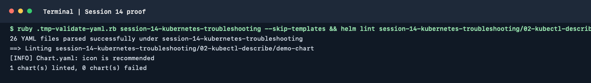

# Kubernetes Troubleshooting

The goal is to learn how to answer:

> "My Kubernetes application is not working. How do I find out why?"

---

## Topics

We will cover:

* `kubectl get`
* `kubectl describe`
* `kubectl logs`
* `kubectl exec`
* `Events`
* `CrashLoopBackOff`
* `ImagePullBackOff`
* `Pending Pods`
* `Service Troubleshooting`
* `DNS Troubleshooting`

---

## Folder Structure

```text
01-kubectl-get
02-kubectl-describe
03-kubectl-logs
04-kubectl-exec
05-events
06-crashloopbackoff
07-imagepullbackoff
08-pending-pod
09-service-dns
mini-project
```

Each folder contains a small practical example.

---

## Troubleshooting Mindset

When an application is not working, don't randomly run commands.

Follow a process:

```text
1. Observe
      │
      ▼
2. Identify the resource
      │
      ▼
3. Check status
      │
      ▼
4. Check details
      │
      ▼
5. Check events
      │
      ▼
6. Check logs
      │
      ▼
7. Enter container if possible
      │
      ▼
8. Test connectivity
      │
      ▼
9. Find root cause
      │
      ▼
10. Fix
      │
      ▼
11. Verify
```

---

## The Five Commands

### 1. `kubectl get`

Use it for a quick view.

```bash
kubectl get pods
```

**Question:**
> "What is happening?"

---

### 2. `kubectl describe`

Use it for detailed information.

```bash
kubectl describe pod <pod-name>
```

**Question:**
> "What details can explain the problem?"

---

### 3. `kubectl logs`

Use it to see application output.

```bash
kubectl logs <pod-name>
```

**Question:**
> "What is the application saying?"

---

### 4. `kubectl exec`

Use it to run commands inside a running container.

```bash
kubectl exec -it <pod-name> -- sh
```

**Question:**
> "What can I see from inside the container?"

---

### 5. `Events`

Use Events to understand what Kubernetes tried to do.

```bash
kubectl get events
```

or:

```bash
kubectl describe pod <pod-name>
```

**Question:**
> "What did Kubernetes try, and what happened?"

---

## Common Kubernetes Problems

### CrashLoopBackOff

```text
Container starts
      │
      ▼
Application crashes
      │
      ▼
Container restarts
      │
      ▼
Crash again
      │
      ▼
CrashLoopBackOff
```

**Check:**

```bash
kubectl logs <pod-name>
kubectl logs <pod-name> --previous
kubectl describe pod <pod-name>
```

---

### ImagePullBackOff

```text
Kubernetes
    │
    ▼
Needs image
    │
    ▼
Pull fails
    │
    ▼
Retries
    │
    ▼
ImagePullBackOff
```

**Check:**

```bash
kubectl describe pod <pod-name>
```

Look at Events.

---

### Pending Pod

```text
Pod created
    │
    ▼
Scheduler tries to find a node
    │
    ▼
Cannot schedule
    │
    ▼
Pending
```

**Check:**

```bash
kubectl describe pod <pod-name>
```

Look at Events.

---

### Service Problem

**Check:**

```bash
kubectl get pods
kubectl get service
kubectl describe service <service-name>
kubectl get endpoints <service-name>
```

Most importantly:

```text
Pod labels
    │
    ▼
Service selector
    │
    ▼
Endpoints
```

They need to match correctly.

---

### DNS Problem

Test from inside a Pod:

```bash
nslookup <service-name>
```

Check CoreDNS:

```bash
kubectl get pods -n kube-system
```

Check CoreDNS logs:

```bash
kubectl logs -n kube-system -l k8s-app=kube-dns
```

---

## Golden Troubleshooting Flow

Students should remember this:

```text
              PROBLEM
                 │
                 ▼
            kubectl get
                 │
                 ▼
           What is the status?
                 │
                 ▼
         kubectl describe
                 │
                 ▼
              Events
                 │
                 ▼
           kubectl logs
                 │
                 ▼
           kubectl exec
                 │
                 ▼
           Test connectivity
                 │
                 ▼
            Find root cause
                 │
                 ▼
                FIX
                 │
                 ▼
              VERIFY
```

---

## Learning

* Check Kubernetes resource status
* Inspect detailed resource information
* Read application logs
* Execute commands inside containers
* Understand Kubernetes Events
* Troubleshoot `CrashLoopBackOff`
* Troubleshoot `ImagePullBackOff`
* Troubleshoot `Pending` Pods
* Troubleshoot Services
* Test Kubernetes DNS
* Identify root causes instead of guessing

---

## Assignment command practice

Run these commands against a lab resource and record what each result tells
you:

```bash
kubectl get pods -o wide
kubectl describe pod <pod-name>
kubectl logs <pod-name>
kubectl logs <pod-name> --previous
kubectl exec -it <pod-name> -- sh
kubectl get events --sort-by=.metadata.creationTimestamp
kubectl explain pods.spec.containers
kubectl top pods
kubectl get services,endpoints,endpointslices
```

`kubectl top` requires Metrics Server. If it is unavailable, record that
prerequisite rather than treating the missing metrics as zero utilization.
Use `kubectl get -o wide` to include node and IP information; use `describe`
and Events to investigate why a resource is not ready.

## Additional common failure states

| Symptom | First checks | Common causes to investigate |
| --- | --- | --- |
| `ErrImagePull` / `ImagePullBackOff` | `kubectl describe pod <pod-name>` | Image name or tag typo, registry access, missing image pull credentials |
| `ContainerCreating` | `kubectl describe pod <pod-name>` and Events | Image download, volume mount, CNI or node-level startup issue |
| Configuration failure | `kubectl describe pod <pod-name>` and `kubectl logs <pod-name> --previous` | Missing ConfigMap/Secret key, invalid value, incorrect mount or environment variable |
| Service has no endpoints | `kubectl get pods --show-labels` and `kubectl get endpoints <service-name>` | Selector mismatch, Pods not ready, or port mismatch |
| DNS lookup fails | `nslookup <service-name>.<namespace>.svc` from a client Pod | Wrong name/namespace, CoreDNS issue, or network policy blocking DNS |

For every challenge in [`mini-project/`](./mini-project/), follow the same
sequence: identify the symptom, gather `get`/`describe`/Events/log evidence,
write down the root cause, apply the smallest correction, and verify the
resource and application connectivity. Capture actual before-and-after
output and do not leave intentionally broken resources running.

## Terminal proof

The captured command parsed the non-template YAML files and passed Helm lint
for the demo chart. It does not represent troubleshooting against a live
Kubernetes cluster.

