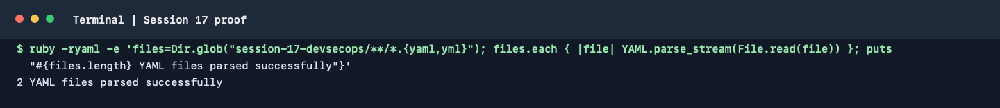

# Session 17: CI/CD and DevSecOps

The runnable Flask application, tests, Dockerfile, Kubernetes manifests and
GitHub Actions workflow are in [`demo/`](./demo/). Topic notes for container
registry, Kubernetes deployment, SAST, SCA, secret scanning, image scanning
and security gates are linked below.

| Topic | Notes |
| --- | --- |
| Container registry | [`02-container-registry/`](./02-container-registry/README.md) |
| Kubernetes deployment | [`03-kubernetes-deployment/`](./03-kubernetes-deployment/README.md) |
| SAST | [`04-sast/`](./04-sast/README.md) |
| SCA | [`05-sca/`](./05-sca/README.md) |
| Secret scanning | [`06-secret-scanning/`](./06-secret-scanning/README.md) |
| Container image scanning | [`07-container-image-scanning/`](./07-container-image-scanning/README.md) |
| Security gates | [`08-security-gates/`](./08-security-gates/README.md) |

The demo's source checks (pytest, CodeQL, pip-audit and Gitleaks) must pass
before the image is built. Trivy blocks images with unfixed HIGH or CRITICAL
vulnerabilities. A push to `main` publishes the approved image to GHCR and
deploys that image to a disposable Kind cluster as a smoke test.

Follow [`demo/README.md`](./demo/README.md) for local setup, pipeline
configuration and cleanup. GitHub Actions results and screenshots must be
captured from an actual run; documentation examples are not execution
evidence.

## Terminal proof

The captured command parsed the two YAML workflow and Kubernetes manifest
files in the demo. This is a syntax check only; SAST, dependency, secret and
container scans must be evidenced by an actual pipeline run.

### Local command run

This session overview contains no runnable shell-command blocks, so there
were no overview commands to execute. The linked `demo/README.md` has its own
lab commands; those nested README commands are outside the overview-only
scope selected for this run.
