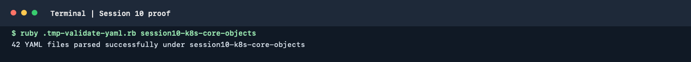

# Session 10: Kubernetes Pods, ReplicaSets and Deployments

This session demonstrates Kubernetes workload objects, Pod lifecycle states,
and four deployment strategies. The manifests are split by exercise so that
each strategy can be applied and verified independently.

## Prerequisites

- A Kubernetes cluster and a working `kubectl` context.
- Run commands from this directory unless a path is shown.

Check the cluster before starting:

```bash
kubectl cluster-info
kubectl get nodes
```

## Core objects

Apply the basic examples:

```bash
kubectl apply -f pod.yml
kubectl apply -f replicaset.yml
kubectl apply -f deployment.yml
kubectl get pods,replicasets,deployments
```

The Deployment owns a ReplicaSet, which maintains the requested number of
Pods. A Pod is the smallest deployable Kubernetes unit. The examples in
[`k8s-core-objects/`](./k8s-core-objects/) include Pod, ReplicaSet, Deployment,
DaemonSet and StatefulSet manifests.

## Deployment strategies

Apply each strategy separately and inspect Pods while updating or switching
the active version. Wait for rollout completion before continuing.

### Rolling update

```bash
kubectl apply -f 01-rolling-update/deployment-v1.yaml
kubectl apply -f 01-rolling-update/service.yaml
kubectl rollout status deployment/app-rolling
kubectl apply -f 01-rolling-update/deployment-v2.yaml
kubectl rollout status deployment/app-rolling
kubectl get pods -o wide
kubectl rollout history deployment/app-rolling
```

Expected observation: Kubernetes replaces old Pods gradually while keeping
the Deployment available according to its rolling-update settings.

### Blue-green

```bash
kubectl apply -f 02-blue-green/deployment-blue.yaml
kubectl apply -f 02-blue-green/deployment-green.yaml
kubectl apply -f 02-blue-green/service-blue.yaml
kubectl apply -f 02-blue-green/service-green.yaml
kubectl get deployments,services,pods --show-labels
```

The Services select their respective color labels. Switch the user-facing
Service selector to the green labels to move traffic to green; verify its
Endpoints before and after the switch.

### Canary

```bash
kubectl apply -f 03-canary/deployment-stable.yaml
kubectl apply -f 03-canary/deployment-canary.yaml
kubectl apply -f 03-canary/service.yaml
kubectl get deployments,pods --show-labels
kubectl get endpoints
```

The Service selects both stable and canary Pods. The canary share of traffic
is controlled by the relative replica counts; Kubernetes Services do not
provide an exact percentage guarantee.

### Recreate

```bash
kubectl apply -f 04-recreate/deployment-v1.yaml
kubectl apply -f 04-recreate/service.yaml
kubectl rollout status deployment/app-recreate
kubectl apply -f 04-recreate/deployment-v2.yaml
kubectl rollout status deployment/app-recreate
kubectl get pods -o wide
```

With the `Recreate` strategy, old Pods are terminated before the replacement
Pods are started, so a brief interruption is expected.

## Pod lifecycle exercises

The numbered manifests in [`pod-lifecycle/`](./pod-lifecycle/) cover Running,
Pending, Succeeded, Failed, CrashLoopBackOff, ImagePullBackOff, probes,
init containers, multiple containers and termination.

Apply and investigate one exercise at a time:

```bash
kubectl apply -f pod-lifecycle/01-running.yaml
kubectl get pod -w
kubectl describe pod <pod-name>
kubectl get events --sort-by=.metadata.creationTimestamp
kubectl logs <pod-name>
```

For each manifest, record the observed status, the relevant `describe` or log
output, the reason for that state and its expected behavior in the relevant
README. Do not infer successful execution from the manifest alone.

## Cleanup

Remove only the exercise resources you created:

```bash
kubectl delete -f pod-lifecycle/01-running.yaml
kubectl delete -f 01-rolling-update/deployment-v1.yaml -f 01-rolling-update/service.yaml
kubectl delete -f 02-blue-green/deployment-blue.yaml -f 02-blue-green/deployment-green.yaml \
  -f 02-blue-green/service-blue.yaml -f 02-blue-green/service-green.yaml
kubectl delete -f 03-canary/deployment-stable.yaml -f 03-canary/deployment-canary.yaml \
  -f 03-canary/service.yaml
kubectl delete -f 04-recreate/deployment-v1.yaml -f 04-recreate/service.yaml
```

Repeat the lifecycle apply/inspect/cleanup process for the remaining numbered
manifests. Replace resource names in commands with the names declared in each
manifest when they differ.

## Terminal proof

The captured command parsed all 42 YAML files in this session. This is a
syntax check only; a live Kubernetes cluster was not available for rollout
verification.

