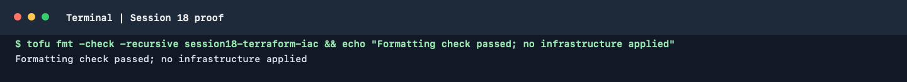

# Session 18: Terraform and Infrastructure as Code

This session introduces Infrastructure as Code and provisions a small S3
bucket with Terraform. It also includes research notes on AWS services used
throughout the course.

## Install the tools

- [Install Terraform](https://developer.hashicorp.com/terraform/tutorials/aws-get-started/install-cli)
- [Install and configure the AWS CLI](https://docs.aws.amazon.com/cli/latest/userguide/getting-started-install.html)
- [Terraform AWS tutorial](https://developer.hashicorp.com/terraform/tutorials/aws-get-started)

Check that Terraform can authenticate before applying anything:

```bash
terraform version
aws sts get-caller-identity
```

Use a non-production training account with least-privilege credentials. Do
not commit credentials, `terraform.tfvars`, state files or saved plan files.

## S3 Terraform hands-on

The project is in [`terraform-s3-demo/`](./terraform-s3-demo/). It creates a
uniquely prefixed S3 bucket with public access blocked, default encryption
and versioning enabled.

```bash
cd terraform-s3-demo
terraform init
terraform fmt -check
terraform validate
terraform plan
```

Review the plan and expected charges before choosing to apply:

```bash
terraform apply
terraform output
terraform show
terraform destroy
```

Destroying the bucket requires it to be empty. Delete any test objects and
versions first. Applying or destroying affects the AWS account configured in
the active CLI credentials; this repository's documentation does not mean
that cloud resources have been created.

## AWS service research

- [IAM: identity and least-privilege access](./aws-services/01-iam/README.md)
- [EC2: compute](./aws-services/02-ec2/README.md)
- [S3: object storage](./aws-services/03-s3/README.md)
- [VPC: networking](./aws-services/04-vpc/README.md)
- [DynamoDB and RDS: databases](./aws-services/05-dynamodb-rds/README.md)

## Terminal proof

The captured OpenTofu formatting check passed for all Terraform files in this
session. OpenTofu is Terraform-compatible; this formatting check did not
initialize providers or create AWS resources.



### Local command run

The documented `terraform` and `aws` executables are not installed
(`terraform: command not found`, `aws: command not found`). OpenTofu v1.13.1
was used for the local Terraform-compatible checks:

```text
tofu init -backend=false  -> initialized hashicorp/aws v6.66.0
tofu fmt -check          -> passed
tofu validate            -> Success! The configuration is valid.
```

The first validation attempt found invalid `type` arguments in `outputs.tf`;
those unsupported attributes were removed before the successful checks above.
`terraform plan`, `apply` and `destroy` were not run: they require AWS access,
and `apply`/`destroy` would change cloud resources.