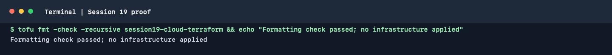

# Session 19: Cloud Infrastructure with Terraform

This session covers cloud service models, AWS regions and availability zones,
VPC networking, route tables, security groups and Terraform workflows. The
hands-on projects are:

- [Terraform VPC](./06-terraform-vpc/README.md)
- [Terraform workflow](./07-terraform-workflow/README.md)
- [EC2 and S3 mini project](./08-mini-project/README.md)

## Terminal proof

The captured OpenTofu formatting check passed for the Terraform files in
this session. It did not initialize providers or create AWS resources.

### Local command run

This overview contains no shell-command blocks. As a local check, I ran
`tofu fmt -check -recursive session19-cloud-terraform`; it exited successfully
with `Terraform formatting check passed.` The detailed Terraform and AWS
commands are in the linked lab READMEs and were not included in the
overview-only scope. No AWS plan or infrastructure change was made.
