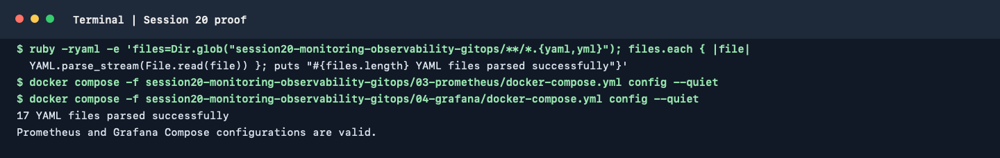

# Session 20: Monitoring, Observability and GitOps

The session combines monitoring demonstrations, the metrics/logs/traces
observability model, and GitOps exercises using Kubernetes and Argo CD.

## Monitoring and metrics

- [`01-monitoring-vs-observability/`](./01-monitoring-vs-observability/README.md)
- [`02-metrics-logs-traces/`](./02-metrics-logs-traces/README.md)
- [`03-prometheus/`](./03-prometheus/README.md)
- [`04-grafana/`](./04-grafana/README.md)

The Prometheus exercise demonstrates scraping and PromQL. The Grafana
exercise connects to Prometheus and builds a dashboard. Run each Compose
project from its own directory and capture actual dashboard/query results:

```bash
docker compose up -d
docker compose ps
docker compose down
```

Do not use the example Grafana credentials outside the local classroom lab.

## GitOps

- [`05-introduction-to-gitops/`](./05-introduction-to-gitops/README.md)
- [`06-git-as-source-of-truth/`](./06-git-as-source-of-truth/README.md)
- [`07-argocd/`](./07-argocd/README.md)
- [`08-mini-project/`](./08-mini-project/README.md)

The mini project walks through a local cluster, Argo CD installation,
registering an Application, changing replicas in Git and observing
reconciliation. Replace the sample repository URL with a repository you
control before applying the Argo CD Application.

Capture actual cluster, sync-health, replica and dashboard output as
assignment evidence. A YAML manifest or sample output alone does not prove
that the lab ran successfully.

## Terminal proof

The captured command parsed all 17 YAML files and validated both monitoring
Compose configurations. The actual Compose start/stop results are recorded
below; Argo CD was not launched.



### Local command run

Ran `docker compose up -d`, `docker compose ps` and `docker compose down`
from both `03-prometheus/` and `04-grafana/`. Both deployments started
successfully, and `down` removed the containers and networks created by these
runs (no volumes were deleted):

```text
03-prometheus: session20-prometheus  Up  Less than a second  0.0.0.0:9090->9090/tcp
04-grafana:    session20-prometheus  Up  Less than a second  0.0.0.0:9090->9090/tcp
               session20-grafana     Up  Less than a second  0.0.0.0:3000->3000/tcp
```
